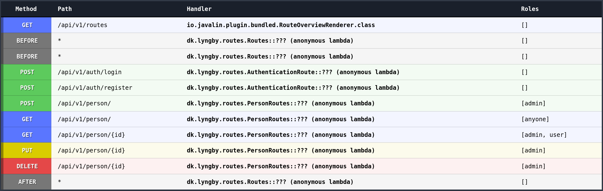
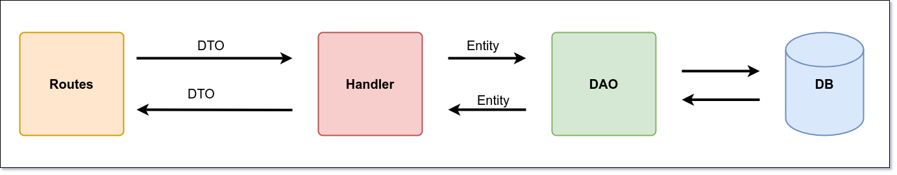

# JAVALIN R.E.S.T API

## Description

This is a simple REST API that allows you to create, read, update and delete;

This project is part of a bigger project that allows for development of an API application with following setup remote and local.

The setup is based on the following two repositories:
1. [Local Environment Setup (development)](https://github.com/tysker/3sem-traefik-setup-local)
   - Includes a local docker-compose setup with a PostgresSQL database and PgAdmin.
2. [Remote Environment Setup (DigitalOcean - production)](https://github.com/tysker/3sem-traefik-setup-remote)
   - Includes a remote docker-compose setup with PostgresSQL database, Traefik (certificates, load balancer, reverse proxy) and watchtower (auto updates of docker images).

You can read more about the setup in the repositories above.

## Technologies used:

- JDK 17 (Java 17)
- Hibernate (JPA Provider)
- Javalin (Web Framework)
- PostgresSQL (Database)
- Maven (Dependency Management)
- Docker (Containerization)
- Docker Compose (Container Orchestration)
- JUnit (Unit Testing)
- Mockito (Mocking Framework)
- Log4j (Logging Framework)
- Testcontainers (Integration Testing)
- Rest Assured (API Testing)

### Prerequisites

- JDK 17
- Docker
- Docker Compose
- Maven
- Git
- Postman (Optional)

### Deployment CI pipeline

1. Change docker image name in GitHub actions file

```yaml
        ......
        
        with:
          context: .
          file: ./Dockerfile
          push: true
          tags: ${{ secrets.DOCKERHUB_USERNAME }}/<your_api_name>:latest
```

2. Make sure yoy have the following secrets in your GitHub repository

- DOCKERHUB_USERNAME
- DOCKERHUB_TOKEN

3. Update the GitHub action file to match your branch name you want to build on

```yaml
on:
  push:
    branches: [ branches_to_build ]

    ......
```

4. Update the pom file with the right properties

```xml
    <properties>
        
        ....
    
        <!-- Project properties  -->
        <!--  token    -->
        <secret.key>your secret key</secret.key>
        <issuer>your domain</issuer>
        <token.expiration.time>3600000</token.expiration.time>
        <!--  DB    -->
        <db.name>database name</db.name>
        <db.username>database username</db.username>
        <db.password>database password</db.password>
        <db.connection.string>jdbc:postgresql://localhost:5432/</db.connection.string>
        <!--  Javalin    -->
        <javalin.port>port number</javalin.port>
    </properties>
```

5. Testcontainers

We are using Testcontainers to run integration tests against a real database. The testcontainers are configured in
the HibernateConfig file under the config folder. The configuration is based on the following properties:

```java
    .....

    1. private static final String DB_DRIVER = "org.postgresql.Driver";
    2. private static final String DB_URL = "jdbc:tc:postgresql:15.3-alpine3.18:///test_db";
    3. private static final String DB_USERNAME = "test";
    4. private static final String DB_PASSWORD = "test";

    .....

```
**For Mac users with M1 and M2 chips has to make some changes to the HibernateConfig file**


Do the following to get the Testcontainers up and running:

1. Run the following commands in your terminal

```bash 
    # New tag (mac m1/m2): 
    docker tag arm64v8/postgres:latest postgresql:15.3-alpine3.18
    
    # Symlink
    sudo ln -s $HOME/.docker/run/docker.sock /var/run/docker.sock
```

***

## API Documentation

### API Endpoints



***

### DTO (Data Transfer Object) and Entity Flow

